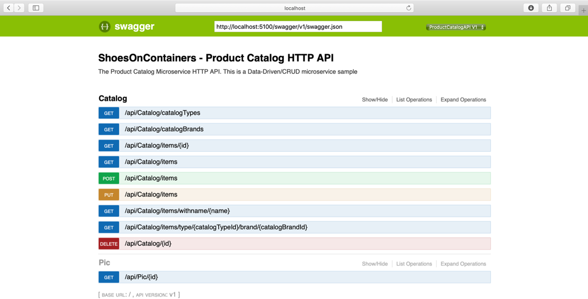
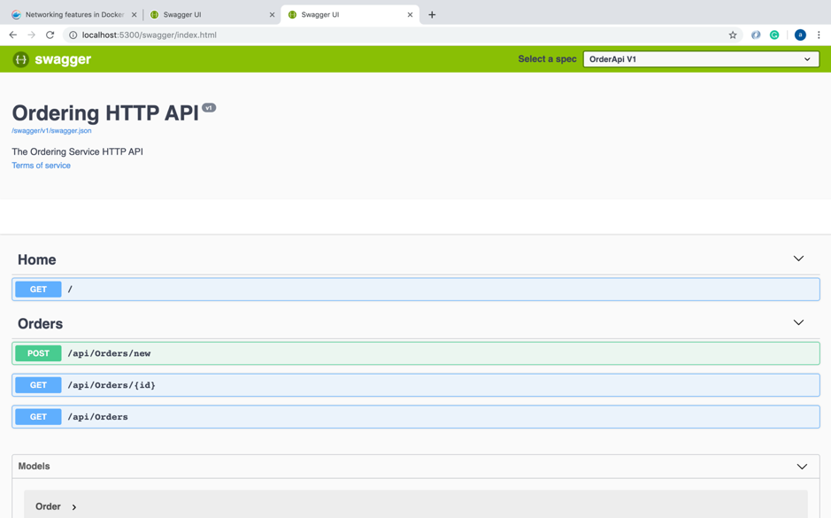
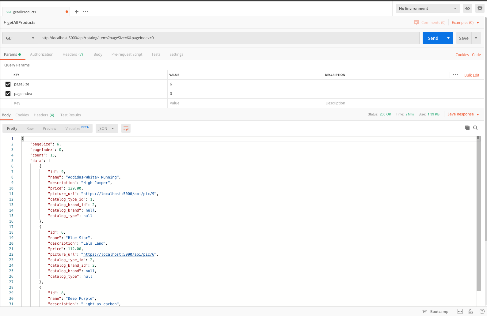
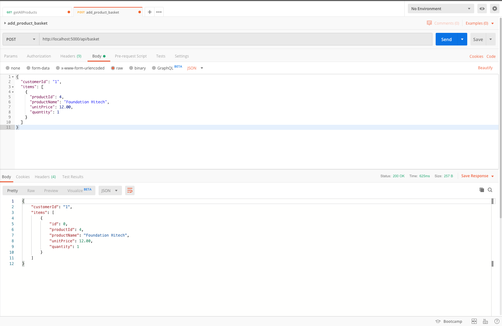
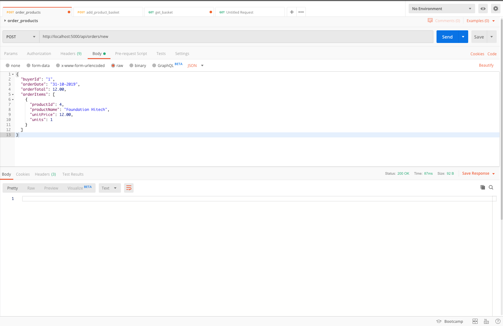
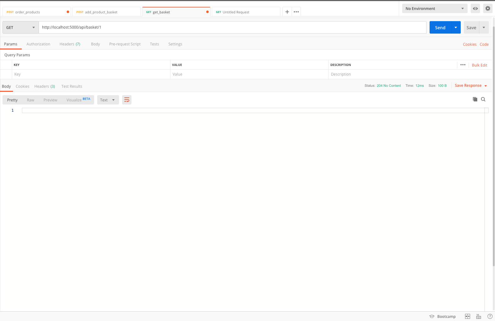

# ShoesOnContainers - Microservices Architecture and Containers based Application


## Overview

This purpose of the project is to develop a microservice architecture based application using .NET Core (C#) and Docker.

The application is a shoe E-Commerce website (like Amazon) that is implemented as a multi-container application. Each container is a microservice developed using .NET Core.
The application consists of 3 microservices:
    1.    Catalog microservice
    2.    Ordering microservice
    3.    Basket microservice
Also, there is an API gateway as an entry point to the internal microservices.


## Starting the Application

Run each of the following command on different terminal

1. Build docker images
```docker-compose build```

2. Start MSSQL server
```docker-compose up mssqlserver```

3. Start Redis
```docker-compose up basket.data```

4. Start rabbitmq
```docker-compose up rabbitmq```

5. Start the catalog microservice
```docker-compose up catalog```

6. Start the ordering microservice
```docker-compose up ordering```

7. Start the basket microservice
```docker-compose up basket```

8. Start the api gateway
```docker-compose up gateway```

# Usage

## Catalog

baseURL = http://localhost:5100/


## Basket

baseURL = http://localhost:5200/



## Ordering

baseURL = http://localhost:5200/


## API Gateway

If you want to use the API Gateway, you can just replace the baseURL with http://localhost:5000/ and then you use the same routes.


# DEMO

## Get the first 6 products

Send a GET request to the Catalog Microservice through the API Gateway





## Add a product to the basket

Send a POST request to the Basket Microservice through the API Gateway



## Order the products


To order a product, you need to send a POST request to the Ordering Microservice through the API Gateway



and now the ordering microservice will publish a message that the customer with customerId = 1 ordered his products, then the basket microservice will catch this message and it will remove all items from his basket.



